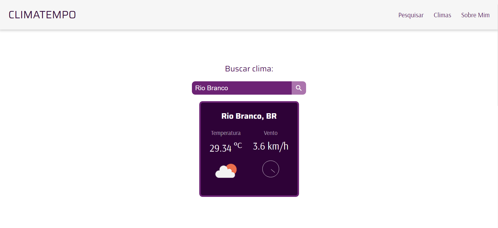

<h1 align="center">CLIMATEMPO</h1>

  <a href="#-tecnologias">Tecnologias</a>&nbsp;&nbsp;&nbsp;|&nbsp;&nbsp;&nbsp;
  <a href="#-projeto">Projeto</a>&nbsp;&nbsp;&nbsp;|&nbsp;&nbsp;&nbsp;
  <a href="#-api">API</a>&nbsp;&nbsp;&nbsp;|&nbsp;&nbsp;&nbsp;
  <a href="#-autor">Autor</a>&nbsp;&nbsp;&nbsp;

 

  

## 🚀 Tecnologias

Esse projeto foi desenvolvido com as seguintes tecnologias:

- HTML
- CSS
- JavaScript

## 💻 Projeto

Projeto desenvolvido por mim para treinar criação de elementos dinâmicos e requisições a api externas.

## 🖥️ API

A api utilizada ma aplicação é: [OpenWeather](https://openweathermap.org)

## 🔖 Autor

- Github: <a href="https://github.com/">MrEzequiel
  </a>
- Instagram: <a href="https://www.instagram.com/ezequield3v/">@ezequield3v</a>

 

Feito com 💜 by Ezequiel
